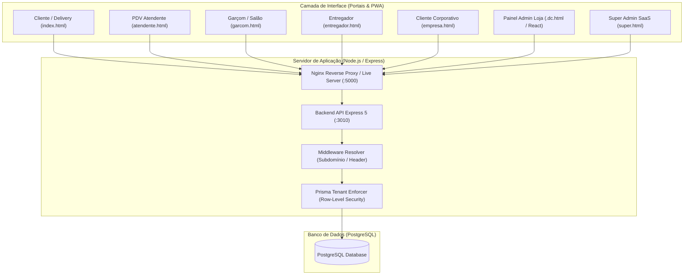

# Relatório de Análise Técnica - Sistema Bel do Frango (Multi-Tenant Restaurant SaaS)

> **Data da Análise:** 07 de Agosto de 2026  
> **Repositório:** `NETOLUIZ/white-restaurante`  
> **Arquitetura Geral:** Platform-as-a-SaaS Multi-Tenant para Gestão de Restaurantes, PDV de Alta Produtividade, Delivery, Comanda de Salão e Canal Corporativo.

---

## 1. Visão Geral da Arquitetura

O sistema é uma plataforma completa de gestão gastronômica e ponto de venda (PDV) construída com arquitetura **Multi-Tenant Row-Level** (banco único com isolamento por `tenantId`). Suporta múltiplos perfis operacionais e canais de vendas em tempo real.



---

## 2. Stack Tecnológica

### Backend & Banco de Dados
| Componente | Tecnologia | Função / Detalhes |
| :--- | :--- | :--- |
| **Runtime** | Node.js (v18+) | Execução assíncrona de alta performance |
| **Framework Web** | Express 5 (`express@^5.1.0`) | Roteamento e middlewares da API REST |
| **ORM** | Prisma ORM (`@prisma/client@^6.6.0`) | Modelagem de dados, migrations e queries fortemente tipadas |
| **Banco de Dados** | PostgreSQL | Armazenamento relacional multitenant com índices otimizados |
| **Autenticação** | JWT (`jsonwebtoken`) + `bcryptjs` | Cookies HTTP-only com isolamento de sessão por papel |
| **Processamento de Imagens**| `sharp` + `multer` | Upload e otimização automática de imagens de produtos/banners |
| **Segurança** | `helmet`, `express-rate-limit`, `cors` | Proteção contra ataques comuns (headers HTTP, Rate Limiting) |

### Frontend & Visualização
| Componente | Tecnologia | Função / Detalhes |
| :--- | :--- | :--- |
| **Arquitetura Web** | HTML5 + Custom Component Framework (`support.js`) + React/TypeScript (`src/`) | Híbrido SPA de altíssima velocidade e zero overhead de bundle inicial |
| **Runtime Customizado** | `DCLogic` (`<x-dc>`, `<sc-if>`, `<sc-for>`) | Bindings reativos leves inspirados em React DOM sem transpilador em produção |
| **Estilização** | Vanilla CSS3 + Design Tokens | Variáveis CSS para temas customizados (`--pos-primary`, `--pos-bg`, etc.) |
| **Impressão Térmica** | ESC/POS HTML Silent Printing | Iframe transparente dedicado para impressão de cupons térmicos (58mm) |

---

## 3. Módulos e Portais da Aplicação

### 3.1. PDV do Atendente (`atendente.html`)
- **Reformulação de Alta Produtividade:** Interface Full HD (1920x1080) dividida em **3 Colunas Fixas (20% / 50% / 30%)**:
  - **Coluna 1 (20%):** Painel de navegação rápida por categorias (*Tamanhos*, *Proteínas*, *Acompanhamentos*, *Bebidas*, *Extras*).
  - **Coluna 2 (50%):** Cards interativos de seleção rápida com suporte a estados visualmente destacados (borda vermelha `#E53935`, fundo amarelo claro, ícone de check animado).
  - **Coluna 3 (30%):** Resumo do pedido permanente com seletor Balcão/Entrega (ocultação automática de endereço para retirada), stepper `[-] 1 [+]`, formas de pagamento em cards (PIX, Cartão, Dinheiro com troco automático), Total em destaque (`#D97706`) e botão de fechamento de 56px.
- **Atalhos Operacionais de Teclado:**
  - `Enter`: Finalizar pedido
  - `Esc`: Voltar / Cancelar
  - `+` e `-`: Alterar quantidade
- **Impressão Térmica Direta:** Geração automática de cupom balcão (impressoras 58mm).

### 3.2. Delivery & Cardápio do Cliente (`index.html`)
- Navegação fluida de produtos por categoria e busca em tempo real.
- Construtor interativo de marmita customizada (opções de tamanho, proteínas e acompanhamentos).
- Carrinho suspenso, código de cupom de desconto e cálculo de frete por bairro.
- Checkout direto e acompanhamento de pedido por código UUID (proteção contra enumeração/IDOR).

### 3.3. Comanda de Salão / Garçom (`garcom.html` / `src/app/mesas`)
- Gestão visual de mesas por status: `LIVRE`, `OCUPADA`, `RESERVADA`, `CONTA`.
- Abertura de comandas e lançamento rápido de itens por mesa.

### 3.4. Portal Corporativo / Canal Empresa (`empresa.html`)
- Atendimento a clientes corporativos em lote (obras, escritórios).
- Autenticação própria e limite diário pré-configurado de pedidos por empresa.

### 3.5. Painel Administrativo da Loja (`Bel do Frango - Admin.dc.html`)
- Cadastro e controle de produtos, categorias, adicionais e cupons.
- Gestão do catálogo do "Monte sua Marmita" (Tamanhos, Proteínas e Complementos).
- Abertura e fechamento de **Caixa do Dia** com soma automática de faturamento.
- Relatórios operacionais e financeiros.

### 3.6. Super Admin SaaS (`super.html`)
- Provisionamento automatizado de novas lojas/tenants via script `criar-tenant.js`.
- Configuração de Feature Flags e Identidade Visual (Branding com paletas e logos customizáveis).
- Suporte a impersonamento de conta para auditoria e suporte avançado.

---

## 4. Arquitetura do Banco de Dados & Multitenancy

O banco PostgreSQL possui schema centralizado com isolamento lógico `tenantId`:

```prisma
model Tenant {
  id       String     @id @default(uuid())
  slug     String     @unique // ex: "belfrango" -> belfrango.dominio.com
  nome     String
  tipo     TipoTenant @default(RESTAURANTE) // RESTAURANTE | MERCANTIL
  ativo    Boolean    @default(true)
  ...
}

model Pedido {
  id                   Int             @id @default(autoincrement())
  tenantId             String
  tenant               Tenant          @relation(fields: [tenantId], references: [id], onDelete: Cascade)
  codigoAcompanhamento String          @default(uuid())
  tipo                 TipoPedido      @default(ENTREGA) // ENTREGA | MESA | RETIRADA | EMPRESA
  formaPagamento       FormaPagamento
  total                Float
  ...
}
```

### Principais Modelos do Schema
- **Catálogo Geral:** `CategoriaProduto`, `Subcategoria`, `Produto`, `Adicional`.
- **Catálogo Marmitas:** `TamanhoMarmita`, `Proteina`, `Complemento`.
- **Operação:** `Pedido`, `ItemPedido`, `Mesa`, `Caixa`, `Cliente`, `Cupom`, `Bairro`.
- **Governança SaaS:** `Tenant`, `TenantBranding`, `TenantFeature`, `SuperAdmin`, `LogImpersonacao`.

---

## 5. Práticas de Segurança Implementadas

1. **Row-Level Tenant Isolation (`prismaTenant.js`):** Interceptador central que garante que todas as consultas ao banco incluam o `tenantId` da requisição ativa, prevenindo acesso cruzado a dados de outros restaurantes.
2. **Proteção IDOR em Acompanhamento de Pedidos:** Uso de UUID v4 (`codigoAcompanhamento`) para rastreamento público de delivery em vez do ID sequencial da tabela.
3. **Senhas & Autenticação:** Criptografia de senhas via `bcrypt` (salt factor 10) e tokens JWT armazenados em cookies HTTP-Only de curta duração.
4. **Proteção de borda:** Suporte nativo ao Nginx como proxy reverso com HTTPS, bloqueio de arquivos estáticos e limitação de taxa por IP (`express-rate-limit`).

---

## 6. Estrutura de Arquivos do Projeto

```
d:\white-res-mec\
├── atendente.html                 # Interface PDV do Atendente (3 Colunas, Altíssima Produtividade)
├── index.html                     # Cardápio & Checkout do Cliente Final
├── garcom.html                    # Interface de Atendimento de Salão / Mesas
├── entregador.html                # Painel de Entregas para Motoboys
├── empresa.html                   # Portal de Pedidos Corporativos
├── super.html                     # Painel Super Admin (SaaS Manager)
├── Bel do Frango - Admin.dc.html  # Painel de Gestão da Loja
├── docker-compose.yml             # Containerização do Ambiente de Produção
├── nginx/
│   └── default.conf               # Configuração do Proxy Reverso Nginx
├── scripts/
│   ├── dev-server.js              # Servidor Local Integrado (Backend + Frontend)
│   ├── support.js                 # Component Runtime (DCLogic)
│   └── tema.js                    # Motor de Temas e Cores
├── src/                           # Aplicação React/TypeScript (Frontend Moderno)
│   ├── app/ (admin, cardapio, checkout, cliente, login, mesas)
│   ├── components/
│   └── services/
└── backend/                       # Backend REST Express + Prisma
    ├── prisma/ (schema.prisma, seed.js, migrations)
    ├── src/
    │   ├── controllers/           # 31 Controllers por domínio de regra de negócio
    │   ├── lib/                   # prismaTenant.js (Row-Level Security)
    │   ├── middleware/            # Autenticação e Resolução de Tenant
    │   ├── routes/                # Definição das rotas REST
    │   └── server.js              # Entrada do Servidor Express
```

---

## 7. Conclusão e Próximos Passos Recomendados

O sistema **Bel do Frango** encontra-se em estado de produção maduro, combinando simplicidade de implantação com recursos avançados de arquitetura multi-tenant.

**Recomendações Técnicas:**
1. **Cobrir rotas críticas com Testes Automatizados (Playwright/Jest):** Adicionar testes E2E para o fluxo completo do PDV do atendente e checkout do cliente.
2. **Monitoramento & Observabilidade:** Integrar APM (ex: Sentry ou Datadog) para rastreamento centralizado de erros em requisições de backend.
